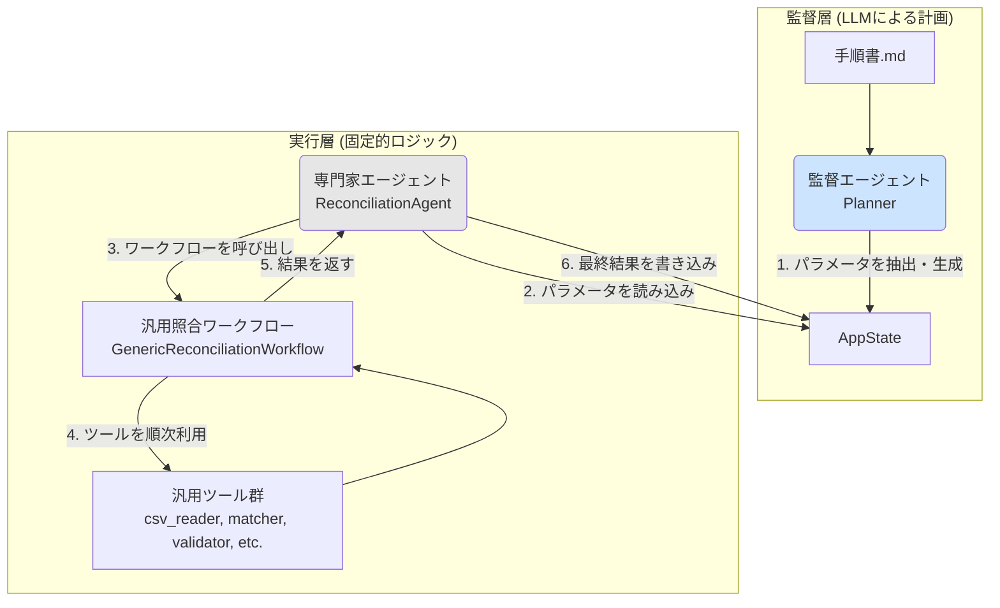

### 新アーキテクチャ提案：監督・専門家モデルの具体化

このアーキテクチャは、**「監督エージェント」**がタスクの指示内容を構造化された**「パラメータ」**に変換し、**「専門家エージェント」**がそのパラメータに基づいて具体的な処理を実行するという役割分担を明確にすることを目的とします。

#### 専門家エージェントの命名

[cite_start]まず、専門家エージェントの名称を、より汎用的な業務内容を表す**「照合エージェント (`ReconciliationAgent`)」**とすることを提案します。これにより、「在庫照合」[cite: 21][cite_start]や「売掛金消込」[cite: 10][cite_start]、「人事データ突合」[cite: 29]といった複数の類似業務を、同じエージェントがパラメータを変えるだけで担当できるようになります。

---

### アーキテクチャ全体像

コンポーネント間の連携とデータの流れを以下に示します。

---

### 各コンポーネントの設計方針と留意点への対策

#### 1. `AppState` (`src/state.py`) の拡張
`planner`からの指示を明確に伝達するため、`AppState`に以下のキーを追加します。
* `next_agent: Optional[str]`: 次に呼び出すべき専門家エージェント名（例: `"reconciliation_agent"`）を格納します。
* `agent_parameters: Optional[Dict[str, Any]]`: 専門家エージェントへの指示内容を格納する辞書です。`planner`が手順書から抽出した全ての情報（入力ファイル、突合キー、検証ルールなど）がここに入ります。

#### 2. 監督エージェント (`src/nodes.py` の `planner` 関数) の責務変更
`planner`は、次に実行すべき**ツール名を返す**役割から、**専門家への指示書（パラメータ）を生成する**役割に変わります。
* [cite_start]**情報抽出タスクへの高度化**: LLMへのプロンプトを改良し、手順書から**構造化されたパラメータ（JSONオブジェクト）を抽出**するようにします。既存の`key_name_detector.py`[cite: 1]の実装を参考に、`PydanticOutputParser`を活用して出力の安定性を確保します。
* **Stateへの書き込み**: 抽出したパラメータを`state['agent_parameters']`に、呼び出すべきエージェント名を`state['next_agent']`に書き込みます。

#### 3. 照合エージェント (`src/agents/reconciliation_agent.py`) の新設
これは`LangGraph`の新しい**ノード**として実装します。
* **アダプターとしての役割**: `AppState`と「汎用照合ワークフロー」を繋ぐアダプターとして機能します。`state['agent_parameters']`を読み込み、その内容を「汎用照合ワークフロー」が理解できる引数の形に整えて渡します。
* **グラフへの接続**: `workflow.py`で`planner`の次に呼び出されるノードとして登録し、処理完了後は`planner`に制御を戻すようにエッジを接続します。

#### 4. 汎用照合ワークフロー (`src/workflows/generic_reconciliation_workflow.py`) の新設
専門家エージェントから呼び出される、再利用可能なモジュールとして実装します。
* **`AppState`からの分離**: このワークフローは`LangGraph`の`State`に依存せず、必要なデータやルールをすべて引数として受け取ります。これにより、単体テストが容易になり、将来的に他のエージェントからの再利用も可能になります。
* **依存性の注入 (DI)**: 「どの検証ツールを使うか」を固定せず、パラメータで指定されたツール（例：`difference_validator`や新設する`numeric_percentage_validator`）を動的に呼び出す柔軟な設計にします。

---

### このアーキテクチャがもたらすメリット

* **拡張性 (スケーラビリティ)**: 新しい照合業務（例：人事データ突合）が追加された場合、`planner`のパラメータ抽出能力を少し強化するだけで、「照合エージェント」はそのまま再利用できます。新しい専門家エージェントを追加する場合も、責務が明確なため開発が容易です。
* **メンテナンス性**: 監督（AIの計画）と実行（固定的ロジック）が分離されるため、問題発生時の切り分けが容易になります。「`planner`のパラメータ抽出がおかしいのか」「ワークフローの計算ロジックが違うのか」を明確に判断できます。
* **再利用性**: 「汎用照合ワークフロー」は、様々な照合タスクで繰り返し利用できるため、開発効率が向上します。